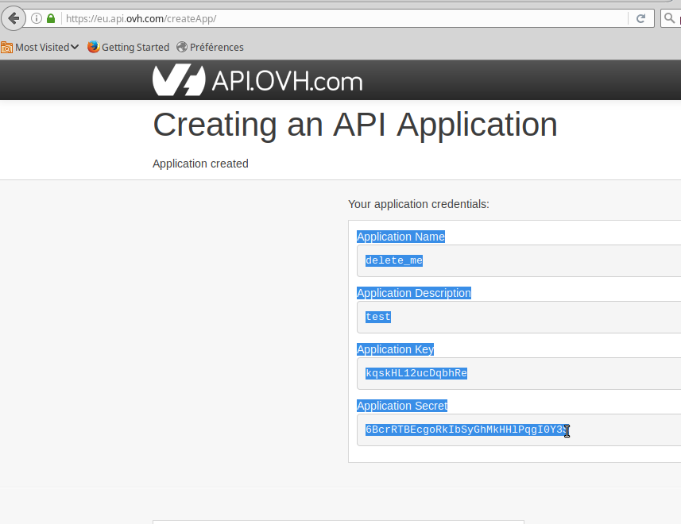

# ovh-tools
Sysadmin tools which works with [OVH API](https://eu.api.ovh.com/console/), in bash and python.

## Status : working draft

There's multiple scripts. The main code is `cloud.sh`.

* `cloud.sh`
* `mk_cred.py`
* `ovh_reverse.py`
* `ovh_snapshot.py`

Documentation is still lacking a lot of details and programming skill is requiered.

## Install

pickup what is needed for your environment:

~~~
git clone https://github.com/opensource-expert/ovh-tools.git
apt install jq python-pip python-dev
pip install ovh
pip install jinja2
~~~

~~~
git clone https://github.com/yadutaf/ovh-cli.git
cd ovh-cli/
pip install -r requirements.txt
# downloads json for API
./ovh-eu
~~~

### supposed folder structure
~~~
.
├── ovh-cli
│   ├── ovhcli
│   │   └── formater
│   └── schemas
└── ovh-tools
    ├── templates
    └── test
~~~

## credential generator script (experimental)
Credential are stored in `ovh.conf` in the local folder. This is the python OVH API way of storing the credential. See
[pyhton API](https://github.com/ovh/python-ovh).

make your credential with: (fixed credential for ovh-eu in `mk_cred.py`)

~~~
cd ~/ovh-tools
./mk_cred.py new
# or if you need to update your credential
./mk_cred.py update 
~~~

Paste it! 
Select on screen info and paste it as is + hit enter.

Sharing credential with ovh-cli

copy credential file: (or copy in both dir ~/ovh-tools/ ~/ovh-cli/)
~~~
cp ovh_conf.tmp ovh.conf
cd ../ovh-cli
ln -s ../ovh-tools/ovh.conf .
~~~

## Run

list your cloud environment
~~~
./cloud.sh
~~~

~~~
./cloud.sh list_instance YOUR_ENV_ID_HERE
~~~

etc… read the code, some param are fixed.

help only grep functions and case entries.
~~~
./cloud.sh help
~~~

## features

See also: [test/all.sh](test/all.sh)

`$proj` is a `project_id` can be saved in cloud.conf via `set_project`

* `list_snap` `$proj` : list available snapshot
* `create` `$proj` `$snap_id` `$hostname` (`sshkey` fixed) `name`
* `get_ssh` `$proj` [`$name`] : list available sshkeys id
* `list_instance` `$proj` : list available runing instance
* `rename` `$proj` `$instance` `$new_name` : rename
* `status` `$proj` [`$instance`] : display json info abouts instances
* `make_snap` `$proj` `$instance` [`$name`] : take a snapshot
* `delete` `$proj` `$instance` ... : delete a runing instance
* all function are callable directly too, read the code
